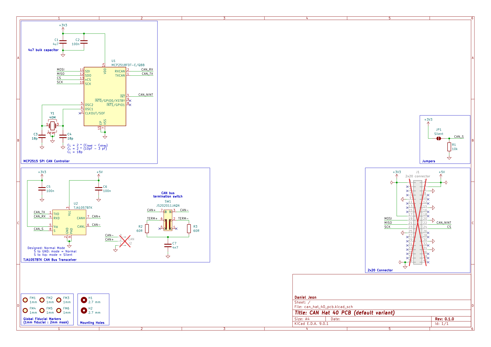

# CAN FD Hat (40-Pin)

---

<details markdown="1">
  <summary>Table of Contents</summary>

<!-- TOC -->
* [CAN FD Hat (40-Pin)](#can-fd-hat-40-pin)
  * [1 Overview](#1-overview)
    * [1.1 Bill of Materials (BOM)](#11-bill-of-materials-bom)
  * [2 Board Specifications](#2-board-specifications)
    * [2.1 Connectors](#21-connectors)
    * [2.2 Switches & Jumpers](#22-switches--jumpers)
    * [2.3 Linux (Ubuntu) Setup](#23-linux-ubuntu-setup)
  * [3 Schematics](#3-schematics)
  * [4 CAD 3D Model](#4-cad-3d-model)
<!-- TOC -->

</details>

---

## 1 Overview

### 1.1 Bill of Materials (BOM)

| Manufacturer Part Number | Manufacturer         | Description                   | Quantity | Notes |
|--------------------------|----------------------|-------------------------------|---------:|-------|
| MCP2518FDT-E/QBB         | Microchip Technology | CAN FD to SPI Controller      |        1 |       |
| TJA1057BTK               | NXP USA Inc.         | CAN Bus Transceiver           |        1 |       |
| JS202011JAQN             | C&K                  | DPDT Slide Switch Right Angle |        1 |       |
| ECS-400-10-37B2-CKY-TR   | ECS Inc.             | 40 MHz crystal                |        1 |       |

---

## 2 Board Specifications

### 2.1 Connectors

Connectors fixed by hardware (PCB traces or the connector itself).

| Connector | Ref | Description                                    |
|-----------|:---:|------------------------------------------------|
| `40-pin`  | J1  | Standard 40-pin (2x20) GPIO pin header         |
| `CAN`     | J2  | Pin 1: ground, Pin 2: CAN high, Pin 3: CAN low |

### 2.2 Switches & Jumpers

User controllable hardware and/or firmware driven inputs.

| Switch/Jumper     | Ref | Description                                         |
|-------------------|:---:|-----------------------------------------------------|
| `CAN termination` | SW1 | 1 + 2 = 120 Ohm termination, 2 + 3 = No termination |
| `CAN silent`      | JP1 | Open = normal operation, closed = silent mode       |

### 2.3 Linux (Ubuntu) Setup

This setup is for Raspberry Pis running Ubuntu and similar Debian distros.

1. Install MCP251XFD required drivers (example showing [
   `can-utils`](https://github.com/linux-can/can-utils)).
   ```shell
   sudo apt update
   sudo apt install -y can-utils
   ```
2. Enable SPI and add the MCP2518FD overlay.
   ```shell
   sudo nano /boot/firmware/config.txt
   ```
   ```shell
   # Add the following lines to config.txt:
   dtparam=spi=on
   dtoverlay=mcp251xfd,spi0-0,oscillator=40000000,interrupt=22,spimaxfrequency=10000000
   ```
3. Reboot the system.
   ```shell
   sudo reboot
   ```
4. Run CAN.
    - For CAN classic setup (example for 500 kbps, 87.5% sample point, bus error
      reporting):
   ```shell
   sudo ip link set can0 down 2>/dev/null || true
   sudo ip link set can0 type can bitrate 500000 sample-point 0.875 berr-reporting on
   sudo ip link set can0 up
   ```
    - For CAN FD setup (example for 1 Mbps nominal rate, 80% sample point, 4
      Mbps data phase rate, bus error reporting):
   ```shell
   sudo ip link set can0 down
   sudo ip link set can0 type can bitrate 1000000 sample-point 0.80 dbitrate 4000000 dsample-point 0.80 fd on berr-reporting on
   sudo ip link set can0 up
   ```

---

## 3 Schematics

Download PDF: [can_hat_40_pcb-schematic.pdf](docs/can_hat_40_pcb-schematic.pdf).



---

## 4 CAD 3D Model

Download PDF: [can_hat_40_pcb-3D.step](docs/can_hat_40_pcb-3D.step).
