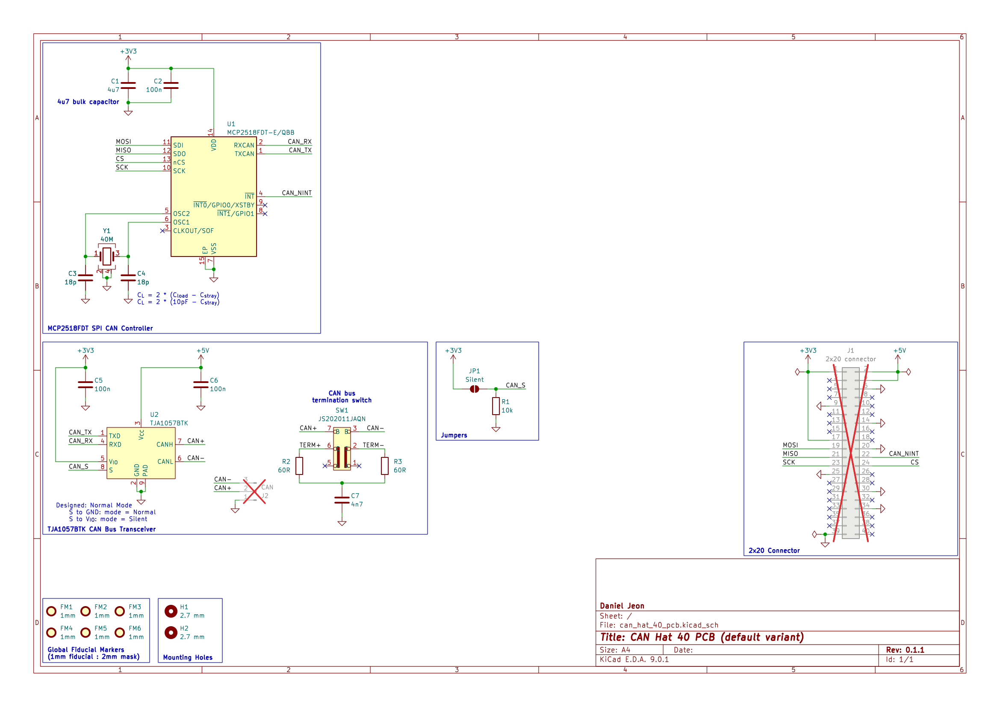

---

  
Table of Contents

<!-- TOC -->
  * [Overview](#overview)
    * [1.1 Bill of Materials (BOM)](#11-bill-of-materials-bom)
  * [2 Board Specifications](#2-board-specifications)
    * [2.1 Connectors](#21-connectors)
    * [2.2 Switches & Jumpers](#22-switches--jumpers)
  * [3 Schematics](#3-schematics)
  * [4 CAD 3D Model](#4-cad-3d-model)
<!-- TOC -->

## Overview

### 1.1 Bill of Materials (BOM)

| Manufacturer Part Number | Manufacturer         | Description                   | Quantity | Notes |
|--------------------------|----------------------|-------------------------------|---------:|-------|
| MCP2518FDT-E/QBB         | Microchip Technology | CAN FD to SPI Controller      |        1 |       |
| TJA1057BTK               | NXP USA Inc.         | CAN Bus Transceiver           |        1 |       |
| JS202011JAQN             | C&K                  | DPDT Slide Switch Right Angle |        1 |       |
| ECS-400-10-37B2-CKY-TR   | ECS Inc.             | 40 MHz crystal                |        1 |       |

---

## 2 Board Specifications

### 2.1 Connectors

Connectors fixed by hardware (PCB traces or the connector itself).

| Connector | Ref | Description                                    |
|-----------|:---:|------------------------------------------------|
| `40-pin`  | J1  | Standard 40-pin (2x20) GPIO pin header         |
| `CAN`     | J2  | Pin 1: ground, Pin 2: CAN high, Pin 3: CAN low |

### 2.2 Switches & Jumpers

User controllable hardware and/or firmware driven inputs.

| Switch/Jumper     | Ref | Description                                         |
|-------------------|:---:|-----------------------------------------------------|
| `CAN termination` | SW1 | 1 + 2 = 120 Ohm termination, 2 + 3 = No termination |
| `CAN silent`      | JP1 | Open = normal operation, closed = silent mode       |

---

## 3 Schematics

Download PDF: [can_hat_40_pcb-schematic.pdf](assets/can_hat_40_pcb-schematic.pdf).

---

## 4 CAD 3D Model

Download PDF: [can_hat_40_pcb-3D.step](assets/can_hat_40_pcb-3D.step).
