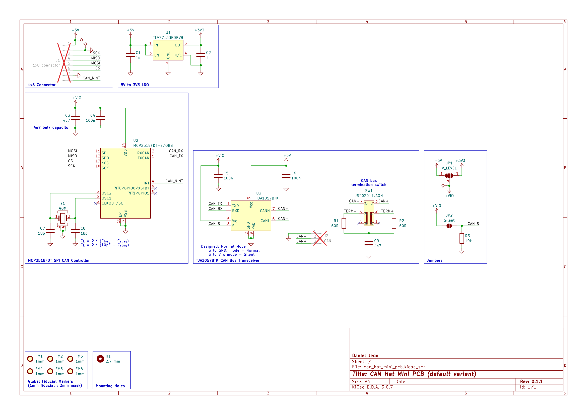

# SPI-CAN Breakout

Product codename: `can_hat_mini`.

A small-footprint, breadboard-friendly breakout board that bridges an SPI host
to a CAN bus. It exposes a standard SPI interface on one side and a CAN
transceiver on the other, letting any microcontroller with SPI talk CAN without
an integrated controller.

---

<details markdown="1">
  <summary>Table of Contents</summary>

<!-- TOC -->
* [SPI-CAN Breakout](#spi-can-breakout)
  * [1 Overview](#1-overview)
    * [1.1 Getting Started](#11-getting-started)
    * [1.2 Bill of Materials (BOM)](#12-bill-of-materials-bom)
  * [2 Board Specifications](#2-board-specifications)
    * [2.1 Connectors](#21-connectors)
    * [2.2 Switches & Jumpers](#22-switches--jumpers)
  * [3 Example Code](#3-example-code)
  * [4 Third-Party Licenses](#4-third-party-licenses)
  * [5 Schematics](#5-schematics)
  * [6 CAD 3D Model](#6-cad-3d-model)
<!-- TOC -->

</details>

---

## 1 Overview

The board pairs a Microchip MCP2518FD SPI-to-CAN controller with an NXP
TJA-series transceiver. This combination supports both classic CAN and CAN FD,
so the same board works for simple low-rate links and for higher-bandwidth CAN
FD applications.

**Key features:**

- Miniature **breadboard-compatible** footprint for quick prototyping.
- **SPI** host interface for Classic CAN and CAN FD via the MCP2518FD
  controller.
- Switch selectable **bus termination** (split 2x 60 Ohm + centre-tap
  capacitor).
- Jumper selectable 5 V or 3.3 V **logic level** for the host interface.
- Jumper selectable **silent mode** (listen-only) for bus monitoring.
- 1x **M2.5 mounting hole**.

### 1.1 Getting Started

1. Wire the 8-pin header to your host:
    1. `5 V` power.
    2. `GND` ground (second pin optional).
    3. SPI lines (`COPI`, `CIPO`, `CS` and `SCK`).
    4. Optionally, but recommended: interrupt `INT` pin.
2. Set the logic level jumper to match your host, the **_default logic level is
   5 V_**.
3. Set bus termination on (`120` mark) or (`NC` mark) off depending on where the
   board sits on the bus (enable 120 Ohm only at the physical ends of the bus).
4. Connect the 3-pin CAN side to your bus (`GND`, CAN high, CAN low).
5. Flash the example firmware and confirm the link.

See the sections below for the full bill of materials, connector and
jumper reference, and a complete working example.

---

### 1.2 Bill of Materials (BOM)

| Manufacturer Part Number | Manufacturer         | Description                   | Quantity | Notes |
|--------------------------|----------------------|-------------------------------|---------:|-------|
| MCP2518FDT-E/QBB         | Microchip Technology | CAN FD to SPI Controller      |        1 |       |
| TJA1057BTK               | NXP USA Inc.         | CAN Bus Transceiver           |        1 |       |
| JS202011JAQN             | C&K                  | DPDT Slide Switch Right Angle |        1 |       |
| ECS-400-10-37B2-CKY-TR   | ECS Inc.             | 40 MHz crystal                |        1 |       |

---

## 2 Board Specifications

### 2.1 Connectors

Connectors fixed by hardware (PCB traces or the connector itself).

| Connector | Ref | Description                                                                                    |
|-----------|:---:|------------------------------------------------------------------------------------------------|
| `8-pin`   | J1  | Pin 1: 5V, Pin 2: GND, Pin 3: SCK, Pin 4: CIPO, Pin 5: COPI, Pin 6: CS, Pin 7: GND, Pin 8: INT |
| `CAN`     | J2  | Pin 1: ground, Pin 2: CAN high, Pin 3: CAN low                                                 |

### 2.2 Switches & Jumpers

User controllable hardware and/or firmware driven inputs.

| Switch/Jumper     | Ref | Description                                         |
|-------------------|:---:|-----------------------------------------------------|
| `CAN termination` | SW1 | 1 + 2 = No termination, 2 + 3 = 120 Ohm termination |
| `V IO`            | JP1 | 1 + 2 closed = 5 V, 2 + 3 closed = 3.3 V            |
| `CAN silent`      | JP2 | Open = normal operation, closed = silent mode       |

---

## 3 Example Code

The following example code was made for an `Arduino Nano` and similar
derivatives showing use with classic CAN (500 kbps).

- The code uses the
  open-source [ACAN2517](https://github.com/pierremolinaro/acan2517) Arduino
  Library.
- The [ACAN2517FD](https://github.com/pierremolinaro/acan2517FD) library should
  also be functional for CAN FD applications.

> Note: The interrupt pin should be attached to a hardware interrupt pin. On the
> `Arduino Nano` this is restricted to `D2` or `D3`.

```c++
#include <SPI.h>
#include <ACAN2517.h>

// Example shown with Arduino Nano.
static const uint8_t CS_PIN = 10;  // D10.
static const uint8_t INT_PIN = 2;  // D2 or D3.
static const uint8_t LED_PIN = 13; // Onboard LED.

ACAN2517 can(CS_PIN, SPI, INT_PIN);

uint8_t test_val = 0;

void process_can_frame(const CANMessage& msg) {
  // Print recieved message.
  Serial.print("RX ID: 0x");
  Serial.print(msg.id, HEX);
  Serial.print("  DLC: ");
  Serial.print(msg.len);
  Serial.print("  Data: ");
  for (uint8_t i = 0; i < msg.len; i++) {
    if (msg.data[i] < 0x10) Serial.print("0");  // Leading zero.
    Serial.print(msg.data[i], HEX);
    Serial.print(" ");
  }
  Serial.println();

  // Very quick LED blink.
  digitalWrite(LED_PIN, !digitalRead(LED_PIN));

  // Send message 0x101 with 1 byte signal incrementing (repeat with overflow).
  CANMessage tx_msg;
  tx_msg.id = 0x101;
  tx_msg.len = 1;
  tx_msg.data[0] = test_val;
  bool status = can.tryToSend(tx_msg);
  test_val++;
}

void setup() {
  Serial.begin(115200);

  delay(50);

  Serial.println("BOOT");

  pinMode(LED_PIN, OUTPUT);
  pinMode(CS_PIN, OUTPUT);
  digitalWrite(CS_PIN, HIGH);
  pinMode(INT_PIN, INPUT_PULLUP);

  SPI.begin();

  // 40 MHz oscillator, 500 kbps classic CAN.
  ACAN2517Settings settings(ACAN2517Settings::OSC_40MHz, 500000);

  uint32_t error = can.begin(settings, [] {
    can.isr();
  });

  Serial.print("begin() error=0x");
  Serial.println(error, HEX);

  if (error != 0) {
    while (true) delay(100);
  }

  Serial.println("CAN init okay");
}

void loop() {
  // Drain receive FIFO.
  while (can.available()) {
    CANMessage msg;
    can.receive(msg);
    process_can_frame(msg);
  }
}
```

---

## 4 Third-Party Licenses

> Arduino and `Arduino Nano` are trademarks of their respective owners. Use of
> these names does **not** imply any endorsement by the trademark holders.

---

## 5 Schematics

Download
PDF: [can_hat_mini_pcb-schematic.pdf](assets/can_hat_mini_pcb-schematic.pdf).



---

## 6 CAD 3D Model

Download STEP file: [can_hat_mini_pcb-3D.step](assets/can_hat_mini_pcb-3D.step).
