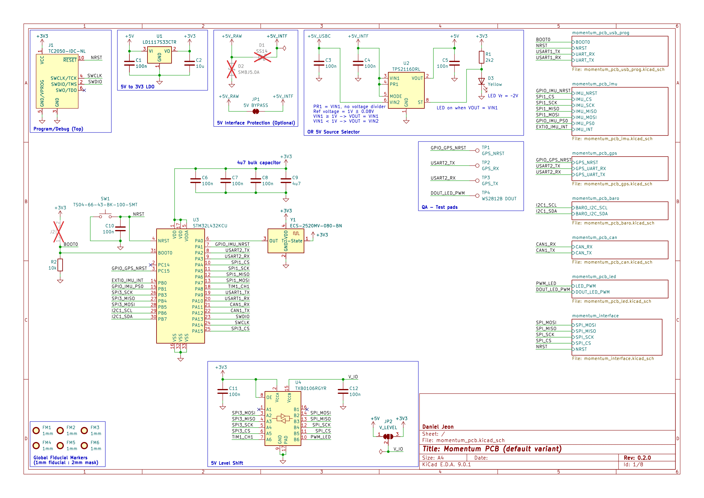
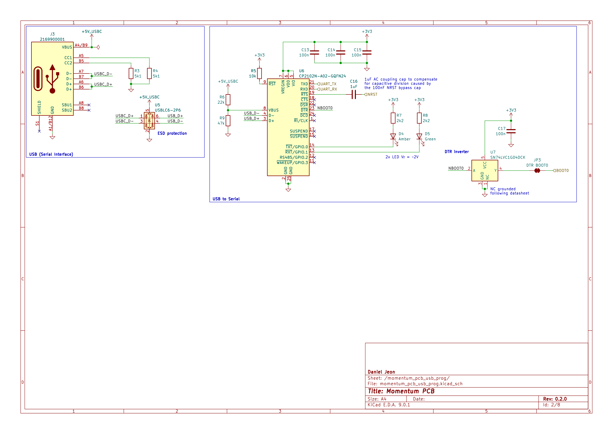
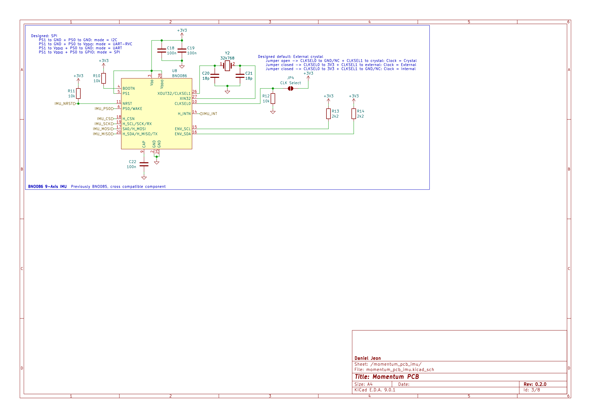
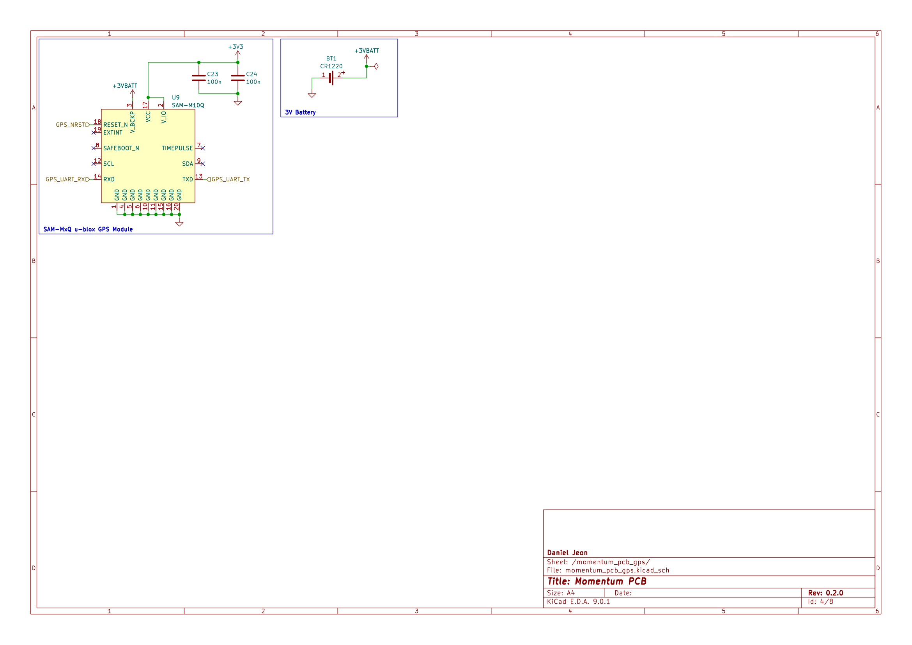
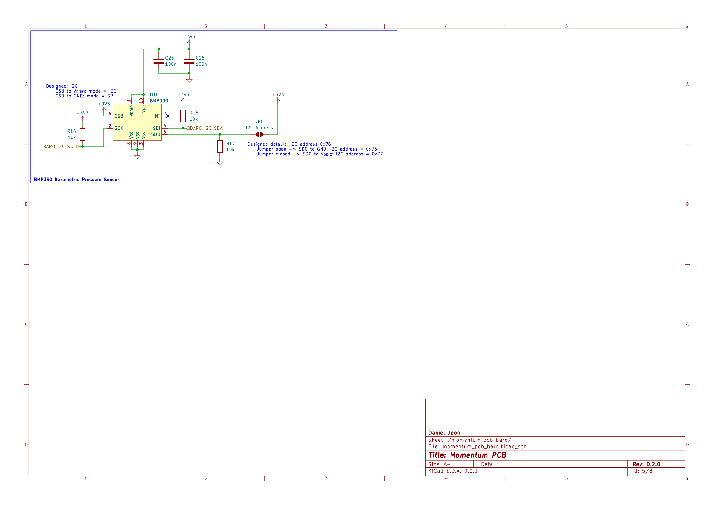
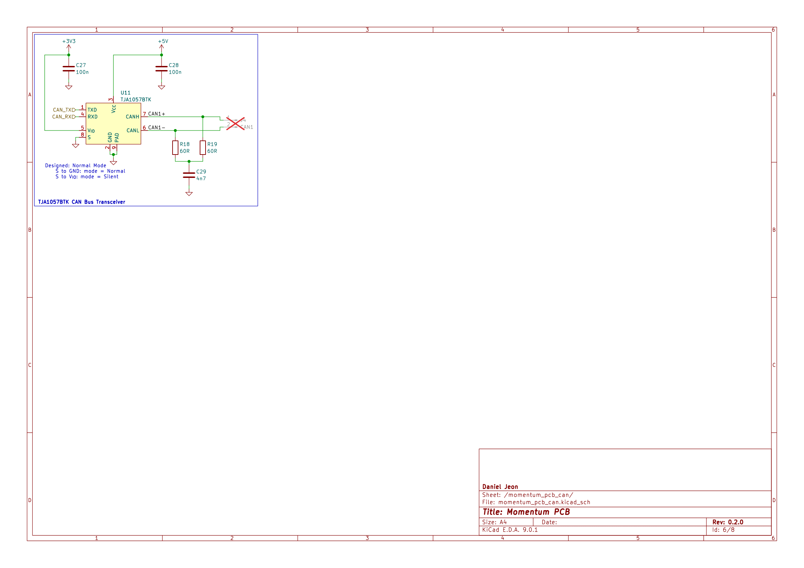
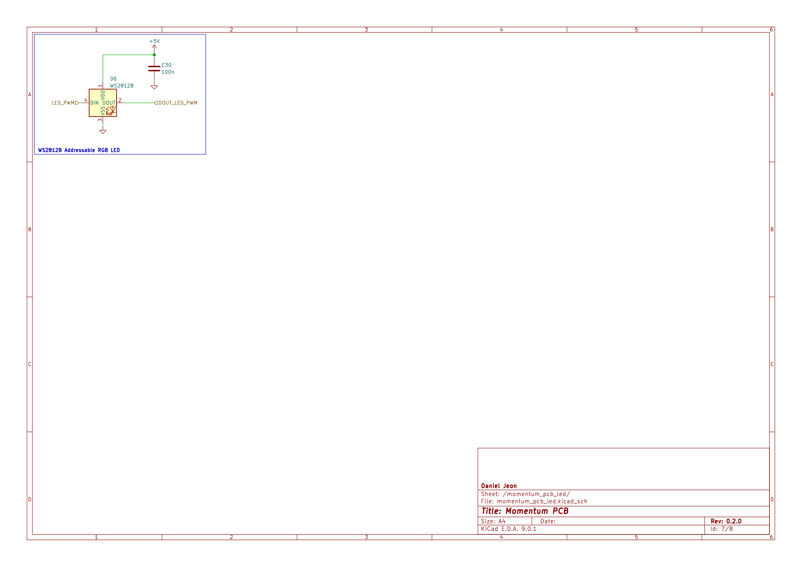
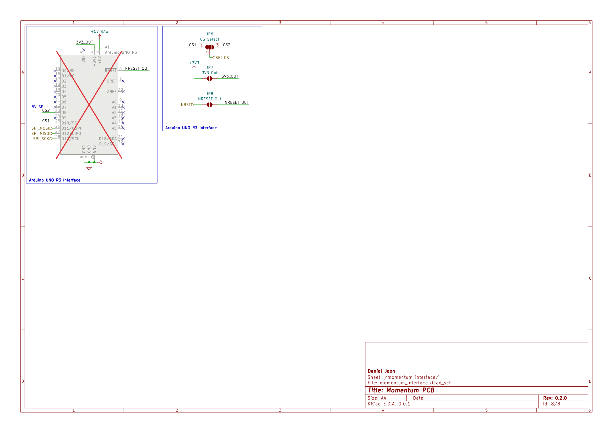

# Momentum: GNSS, 9-DOF IMU, Barometer Sensor Shield

> This document also applies to **Momentum Lite** which the same board design,
> with reduced components (no GNSS).

---

  
Table of Contents

<!-- TOC -->
* [Momentum: GNSS, 9-DOF IMU, Barometer Sensor Shield](#momentum-gnss-9-dof-imu-barometer-sensor-shield)
  * [1 Overview](#1-overview)
    * [1.1 Bill of Materials (BOM)](#11-bill-of-materials-bom)
    * [1.2 Block Diagram](#12-block-diagram)
  * [2 Board Specifications](#2-board-specifications)
    * [2.1 Connectors](#21-connectors)
    * [2.2 Switches & Jumpers](#22-switches--jumpers)
    * [2.3 Batteries](#23-batteries)
    * [2.4 LEDs](#24-leds)
    * [2.5 Test Pads](#25-test-pads)
    * [2.6 Power Supply](#26-power-supply)
      * [2.6.1 5 V Power OR Switch](#261-5-v-power-or-switch)
      * [2.6.2 Optional 5 V Pin Supply Protection](#262-optional-5-v-pin-supply-protection)
      * [2.6.3 3.3 V LDO Supply](#263-33-v-ldo-supply)
    * [2.7 SPI Interface](#27-spi-interface)
    * [2.8 Level Shifter](#28-level-shifter)
    * [2.9 STM32L432KC Flashing](#29-stm32l432kc-flashing)
    * [2.10 USB-C Serial Interface](#210-usb-c-serial-interface)
  * [3 Schematics](#3-schematics)
<!-- TOC -->

---

## 1 Overview

### 1.1 Bill of Materials (BOM)

| Manufacturer Part Number | Manufacturer            | Description                       | Quantity | Notes |
|--------------------------|-------------------------|-----------------------------------|---------:|-------|
| STM32L432KC              | STMicroelectronics      | 32-bit MCU                        |        1 |       |
| CP2102N-A02-GQFN24R      | Silicon Labs            | USB 2.0 to UART Interface         |        1 |       |
| BNO086                   | CEVA Technologies, Inc. | 9-DOF IMU                         |        1 |       |
| BMP390                   | Bosch Sensortec         | Barometric Pressure Sensor        |        1 |       |
| TJA1057BTK               | NXP USA Inc.            | CAN Bus Transceiver               |        1 |       |
| SAM-M10Q                 | u-blox                  | RF Receiver Galileo, GLONASS, GPS |        1 |       |
| WS2812B                  | (Various)               | PWM Addressable RGB LED           |        1 |       |

> **Note:** Momentum was originally designed for the BNO085, however hardware
> files were updated to reflect use of the newer BNO086. Firmware is cross
> compatible for both the BNO085/6, however source files maintain the use of
> the "BNO085" naming.

### 1.2 Block Diagram

---

## 2 Board Specifications

### 2.1 Connectors

Connectors fixed by hardware (PCB traces or the connector itself).

| Connector            | Ref | Description                                           |
|----------------------|:---:|-------------------------------------------------------|
| `Tag-Connect TC2050` | J1  | SWD programming/debug connector                       |
| `BOOT0 jumper`       | J2  | Open for run flash memory (pull-down on open)         |
| `USB-C`              | J3  | USB-to-serial programming/debug, secondary 5 V source |
| `CAN1`               | J4  | Pin 1: CAN1 High, Pin 2: CAN1 Low                     |

### 2.2 Switches & Jumpers

User controllable hardware and/or firmware driven inputs.

| Switch/Jumper                 | Ref | Description                                                                    |
|-------------------------------|:---:|--------------------------------------------------------------------------------|
| `Sensor Hub MCU reset button` | SW1 | Generic 6 mm TH button, push to reset                                          |
| `5 V bypass`                  | JP1 | Closed = Short protection (schottky) diode pads, open = enforce schottky diode |
| `Level shifter V IO`          | JP2 | 1 + 2 closed = 5 V, 2 + 3 closed = 3.3 V                                       |
| `BOOT0 DTR bridge`            | JP3 | Closed = CP2102N DTR BOOT0 control, open = Manual BOOT0                        |
| `BNO086 clock select`         | JP4 | Open = crystal, closed = external/internal                                     |
| `BMP390 I2C address`          | JP5 | Open = `0x76`, closed = `0x77`                                                 |
| `Interface SPI CS pin select` | JP6 | 1 + 2 closed = CS1 (`D10`), 2 + 3 closed = CS2 (`D8`)                          |
| `Interface 3.3 V output`      | JP7 | Open = no output, closed = 3.3 V LDO output bridged                            |
| `Interface NRESET output`     | JP8 | Open = no output, closed = STM32 NRST bridged                                  |

### 2.3 Batteries

Onboard battery supplies.

| Battery               | Ref | Description                       |
|-----------------------|:---:|-----------------------------------|
| `CR1220 battery cell` | BT1 | u-blox GNSS RTC and ephemeris RAM |

### 2.4 LEDs

LEDs used to show board status and/or user controllable.

| Test Point    | Mark                      | Description                                  |
|---------------|---------------------------|----------------------------------------------|
| `UART TX`     | Silkscreen: "TX"          | Green LED: blinking = transmitting data      |
| `UART RX`     | Silkscreen: "RX"          | Amber LED: blinking = receiving data         |
| `5 V Supply`  | Silkscreen: Lighting bolt | Amber LED: on = `5V` pin, off = (only) USB-C |
| `WS2812B LED` | None                      | RGB addressable LED                          |

### 2.5 Test Pads

| Test Point        | Ref | Description               |
|-------------------|:---:|---------------------------|
| `GNSS NRST`       | TP1 | u-blox GNSS NRST net      |
| `GNSS RX`         | TP2 | u-blox GNSS RX net        |
| `GNSS TX`         | TP3 | u-blox GNSS TX net        |
| `WS2812B LED PWM` | TP4 | DOUT from onboard WS2812B |

### 2.6 Power Supply

The board can be powered by either of the following methods:

1. 5V pin via the Uno-style interface.
2. Onboard USB-C connector.

#### 2.6.1 5 V Power OR Switch

The 5 V supply is managed by an OR power switch (TPS2116DRL).

The `5V` pin from the Uno-style interface takes priority. As long as ~1 V or
more is present on this pin, it will be used as the power source. If this
condition is not met, the board automatically switches to the USB-C 5 V supply.

#### 2.6.2 Optional 5 V Pin Supply Protection

The `5V` pin supply can be configured with optional protection diodes (default
not included), see the following instructions:

- The `5 V bypass` jumper must be cut to stop shorting of the schottky diode
  pads, enforcing the schottky diode.
- Schottky diode required (designator `D1`, footprint SMA).
    - Intended to provide reverse polarity protection.
- TVS diode required (designator `D2`, footprint SMB).
    - Intended to provide short high voltage clamping.

#### 2.6.3 3.3 V LDO Supply

The 3.3 V supply is managed onboard by a dedicated 5 V to 3.3 V LDO, independent
of any connected board.

If the user wishes to use the Momentum dev board's 3.3 V supply for low current
applications, the `Interface 3.3 V output` jumper can be bridged, allowing for
3.3 V to be supplied from the onboard LDO. This should only be done with
caution, as a connected main controller which would supply its own 3.3 V on the
same Uno-style interface `3.3V` output pin.

### 2.7 SPI Interface

All SPI pins interfacing with connected boards are level-shifted. By default,
the external SPI pins are level shifted to 5 V. However, it can also be shifted
to 3.3 V via the `Level shifter V IO` 3-pad jumper.

> See section [2.8 Level Shifter](#28-level-shifter) for details.

The SPI CS pin can be swapped between the Uno-style interface pins `D10`
(default) and `D8` via the `Interface SPI CS pin select` jumper. This is
intended to help resolve any pin conflicts.

### 2.8 Level Shifter

Note the level shifter interfaces with the SPI singals (CIPO, COPI, SCK and CS)
as well as the WS2812B PWM data line. Adjusting the `Level shifter V IO` 3-pad
jumper toggles the voltage shifting between 3.3 V and 5 V.

If you opt for 3.3 V shifting, be aware that the **WS2812B LED may exhibit
instability**. The WS2812B datasheet states:

1. DIN high signal >= 0.7 * VDD
2. DIN low <= 0.3 * VDD

Thus, a 3.3 V signal may not be able to meet the DIN high requirement, reducing
functionality of the WS2812B in this level shifting configuration.

### 2.9 STM32L432KC Flashing

The official STM32L432KC Momentum firmware is managed
here: [`momentum`](https://github.com/scalpelspace/momentum).

The STM32L432KC can be flashed in 3 different ways:

1. SWD via Tag-Connect TC2050 interface.
2. Hands-free UART bootloader via USB-C (CP2102N USB-to-UART).
3. Manual BOOT0 jumper with UART bootloader via USB-C (CP2102N USB-to-UART).

For use of the USB-C UART bootloader interface, the custom flashing
software [`pyblasher`](https://github.com/scalpelspace/pyblasher) is highly
recommended.

All three options are available by default, however it is **suggested to use
options 1 and 2** based on user preference.

**Option 3** is applicable for users who wish to use the USB-C for as both a
serial and UART bootloader interface. In this method, the through-hole
`BOOT0 jumper` must be manually bridged to assert BOOT0.

> See section [2.10 USB-C Serial Interface](#210-usb-c-serial-interface) for
> details.

### 2.10 USB-C Serial Interface

The USB-C interface connected via the CP2102N USB-to-UART is primarily designed
as a UART bootloader flashing interface, however can also be used as a serial
interface for simple communication to a desktop computer.

Due to the design for hands-free flashing, the STM32's BOOT0 will be controlled
by the CP2102N's DTR pin. Thus, when a COM port is established BOOT0 will be
raised high, entering the bootloader. To prevent this behaviour, the
`BOOT0 DTR bridge` jumper can be cut, allowing for USB-C serial communication.

If the user wishes to still use the UART bootloader with this modification, the
BOOT0 must be asserted manually to enter the bootloader via the through-hole
`BOOT0 jumper`.

---

## 3 Schematics

Download PDF: [momentum_pcb-schematic.pdf](docs/momentum_pcb-schematic.pdf)

