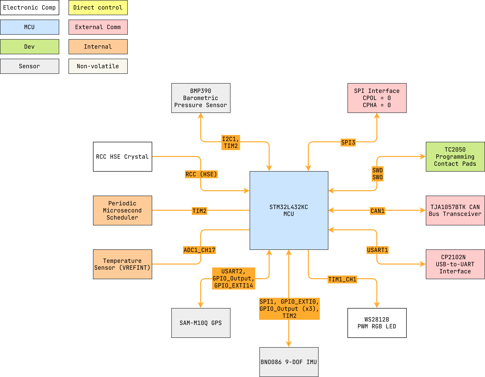

---

  
Table of Contents

<!-- TOC -->
  * [1 Overview](#1-overview)
    * [1.1 Block Diagram](#11-block-diagram)
<!-- TOC -->

---

## 1 Overview

The official STM32L432KC Momentum firmware is managed
here: [momentum](https://github.com/scalpelspace/momentum).

See [Momentum - Hardware, STM32L432KC Flashing](#29-stm32l432kc-flashing)
for details on how to update the firmware via
the [`pyblasher`](https://github.com/scalpelspace/pyblasher) software.

> **Note:** Momentum was originally designed for the BNO085, however hardware
> files were updated to reflect use of the newer BNO086. Firmware is cross
> compatible for both the BNO085/6, however source files maintain the use of
> the "BNO085" naming.

### 1.1 Block Diagram

